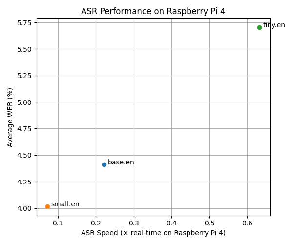
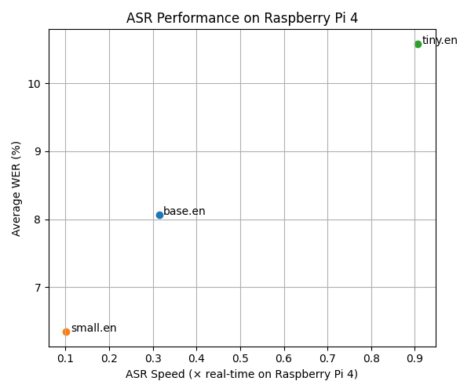
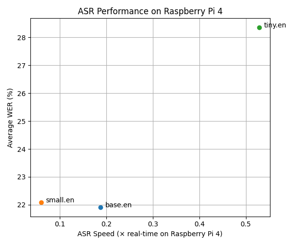

# Dokumentation: Vergleich von Speech-to-Text-Modellen hinsichtlich Genauigkeit und Latenz

## Ziel

Ziel des Projekts ist der systematische Vergleich verschiedener Automatic-Speech-Recognition-(ASR)-Modelle hinsichtlich ihrer Transkriptionsgenauigkeit und Inferenzgeschwindigkeit. Dabei werden mehrere Modelle unter identischen Bedingungen auf denselben Sprachdatensätzen getestet und anhand definierter Metriken bewertet.

Die zentrale Forschungsfrage lautet:

> Wie unterscheiden sich verschiedene ASR-Modelle in der Word Error Rate (WER) und der Inferenzzeit, und welche Auswirkungen hat dies auf den Einsatz in Echtzeit-Voice-Assistants?

---

## Motivation

ASR-Modelle zeigen typischerweise einen Zielkonflikt zwischen Genauigkeit und Geschwindigkeit. Modelle mit hoher Transkriptionsqualität benötigen häufig mehr Rechenleistung und verursachen höhere Latenzen, während schnellere Modelle oft weniger präzise Ergebnisse liefern.

Gerade auf ressourcenbeschränkten Systemen wie dem Raspberry Pi 4 ist es wichtig zu verstehen, welches Modell einen Kompromiss zwischen Performance und Genauigkeit bietet. Die Ergebnisse helfen dabei, Entscheidungen für den Einsatz in ressourenbeschränkten Systemen und Echtzeitanwendungen zu treffen.

---

## Randbedingungen

Die Evaluation wurde unter einheitlichen Bedingungen durchgeführt:

- Durchführung der Experimente auf einem Raspberry Pi 4
- Betrieb der Modelle als lokale HTTP-Services
- Verwendung von Huggingface Datensätzen
- Streaming-basierter Zugriff auf die Daten
- einheitlicher Durchlauf einer Pipeline

Diese Bedingungen gewährleisten eine faire Vergleichbarkeit der Modelle.

---

## Konzeptionierung

Die Software soll modular aufgebaut werden, um Erweiterbarkeit und Wartbarkeit sicherzustellen. Ein einheitliches Interface mit einer abstrakten Corpus Klasse für die Datensätze ermöglicht die einfache Integration neuer Datensätze, während Modelle ausgetauscht werden können, ohne die Pipeline anzupassen. Außerdem muss eine klare Trennung zwischen der Evaluation und der Visualisierung der Ergebnisse bereitgestellt werden, sodass beide Prozesse unabhängig voneinander genutzt werden können.

---

## Implementierung

### Pipeline

Die Pipeline umfasst zwei Hauptprozesse. Einer davon ist die Evaluation, die über das Script `eval_stt.py` umgesetzt wird. Die Darstellung der Ergebnisse erfolgt anschließend mit dem Script `plot_stt.py`.

Die Pipeline führt dabei die folgenden Schritte durch:

1. Laden eines Audiosamples
2. Resampling auf 16 kHz
3. Messung der Inferenzzeit
4. Übertragung an das ASR-Modell über HTTP
5. Berechnung der Word Error Rate (WER)
6. Speicherung der Ergebnisse in einer CSV-Datei
7. Visualisierung der Resultate

### Audioverarbeitung

Das Audio wird als WAV-Byte-Stream an das jeweilige Modell gesendet. Die Inferenzzeit wird pro Sample gemessen und zur Berechnung des Real-Time-Faktors verwendet:

RTF = Audiolänge / Inferenzzeit

Interpretation:

- RTF > 1 → schneller als Echtzeit
- RTF = 1 → Echtzeitfähig
- RTF < 1 → langsamer als Echtzeit

### Berechnung der Word Error Rate

Vor der Berechnung werden Referenztext und Modellhypothese normalisiert:

- Umwandlung in Kleinbuchstaben
- Entfernen von Sonderzeichen
- Normalisierung von Leerzeichen

Die WER berücksichtigt Einfügungen, Löschungen und Ersetzungen.

---

## Ergebnisse

Die Ergebnisse wurden in einem Scatter-Plot dargestellt:

- X-Achse: Geschwindigkeit relativ zur Echtzeit (RTF)
- Y-Achse: durchschnittliche WER

Modelle im rechten unteren Bereich gelten als optimal, da sie sowohl schnell als auch genau sind.

### Librispeech

Abb.1 Auswertung der CSV mit Pandas des Datensatzes Librispeech

| Modell   | WER        | Geschwindigkeit |
| -------- | ---------- | --------------- |
| tiny.en  | ca. 5.70 % | ca. 0.63        |
| base.en  | ca. 4.40 % | ca. 0.22        |
| small.en | ca. 4.02 % | ca. 0.07        |

### Fleurs

Abb.2 Auswertung der CSV mit Pandas des Datensatzes Fleurs

| Modell   | WER         | Geschwindigkeit |
| -------- | ----------- | --------------- |
| tiny.en  | ca. 10.55 % | ca. 0.90        |
| base.en  | ca. 8.04 %  | ca. 0.31        |
| small.en | ca. 6.36 %  | ca. 0.10        |

### Peoples Speech

Abb.3 Auswertung der CSV mit Pandas des Datensatzes Peoples Speech. (Die Ergebnisse dieses Datensatzes sollten mit Vorsicht interpretiert werden. Eine Erläuterung erfolgt im folgenden Abschnitt.)

| Modell   | WER         | Geschwindigkeit |
| -------- | ----------- | --------------- |
| tiny.en  | ca. 28.34 % | ca. 0.52        |
| base.en  | ca. 21.86 % | ca. 0.18        |
| small.en | ca. 22.05 % | ca. 0.06        |

Unter den gegebenen Bedingungen erreichte keines der Modelle vollständige Echtzeitfähigkeit.

---

## Auswertung und Vergleich der Testergebnisse

In den durchgeführten Tests wurden drei verschiedene ASR-Modelle (tiny.en, base.en und small.en) auf mehreren Sprachdatensätzen untersucht. Ziel war es, die Modelle hinsichtlich ihrer Genauigkeit (Word Error Rate, WER) und ihrer Geschwindigkeit auf dem Raspberry Pi 4 zu vergleichen.

### Vergleich der Modelle

In allen Diagrammen bis auf den `Peoples Speech` Datensatz, verhalten sich die Modelle erwartungsgemäß:

- Das **tiny.en-Modell** ist am schnellsten, hat aber die höchste Fehlerrate.
- Das **base.en-Modell** stellt einen Kompromiss zwischen Geschwindigkeit und Genauigkeit dar.
- Das **small.en-Modell** liefert die besten Transkriptionen, benötigt jedoch am meisten Rechenzeit.

Dieses Verhalten zeigt den typischen Zusammenhang bei Speech-to-Text-Modellen: Größere Modelle sind genauer, aber langsamer.

---

### Unterschiede zwischen den Datensätzen

Ein besonders auffälliges Ergebnis ist, dass die Fehlerrate stark vom verwendeten Datensatz abhängt.

#### LibriSpeech

Beim LibriSpeech-Datensatz sind die Fehlerraten insgesamt am niedrigsten. Das liegt daran, dass die Aufnahmen sehr sauber sind und die Sprecher deutlich und langsam lesen. Außerdem gibt es kaum Hintergrundgeräusche. Dadurch können die Modelle die Sprache leichter erkennen.

#### FLEURS

Beim FLEURS-Datensatz steigen die Fehlerraten sichtbar an. Hier sprechen viele unterschiedliche Personen mit verschiedenen Akzenten und Sprechweisen. Auch die Aufnahmequalität ist weniger einheitlich. Diese Faktoren machen die Spracherkennung schwieriger und führen zu mehr Fehlern.

#### Peoples Speech

Die höchsten Fehlerraten treten beim Peoples Speech-Datensatz auf. Dieser Datensatz enthält sehr unterschiedliche Audioquellen wie Gespräche, Vorträge oder Aufnahmen mit Hintergrundgeräuschen. Teilweise sind die Aufnahmen weniger klar oder enthalten spontane Sprache. Dadurch wird die Aufgabe für die Modelle deutlich anspruchsvoller.

| Modell   | Referenztext | Hypothese             | WER |
| -------- | ------------ | --------------------- | --- |
| tiny.en  | yeah         | You gotta be careful. | 4.0 |
| base.en  | yeah         | You gotta be careful. | 4.0 |
| small.en | yeah         | You gotta be careful. | 4.0 |

Zudem ist uns bei der Auswertung des PeopleSpeech-Datensatzes aufgefallen, dass einzelne Referenztranskripte nicht mit dem tatsächlich gesprochenen Audio übereinstimmen. So war beispielsweise für ein Sample der Referenztext „yeah“ angegeben, während alle getesteten Modelle übereinstimmend „You gotta be careful.“ transkribierten. Beim Abhören der Audiodatei zeigte sich, dass die Modellhypothesen dem gesprochenen Inhalt nahezu exakt entsprachen, wodurch die berechnete Word Error Rate (WER) in diesem Fall nicht die tatsächliche Modellleistung widerspiegelt. Auch auf der Datensatzseite wird darauf hingewiesen, dass vereinzelt Wörter im Transkript fehlen oder zusätzliche Wörter enthalten sein können. Entsprechend sind die Ergebnisse auf diesem Datensatz mit Vorsicht zu interpretieren.

---

### Geschwindigkeit der Modelle

Die Geschwindigkeit der Modelle bleibt über die verschiedenen Datensätze hinweg relativ ähnlich. Das liegt daran, dass die Rechenzeit hauptsächlich von der Modellgröße und der Hardware abhängt und weniger vom Inhalt der Audiodaten.

Keines der getesteten Modelle erreicht auf dem Raspberry Pi eine Verarbeitung in echter Echtzeit. Das bedeutet, dass die Transkription länger dauert als die eigentliche Audiolänge.

---

### Interpretation der Ergebnisse

Die Ergebnisse zeigen deutlich, dass die Leistung eines ASR-Systems stark davon abhängt, wie ähnlich die Testdaten den Trainingsdaten sind. Saubere und klar gesprochene Sprache führt zu guten Ergebnissen, während reale Aufnahmen mit Geräuschen oder unterschiedlichen Sprechern die Fehlerrate erhöhen.

Außerdem wird sichtbar, dass kleinere Modelle schneller arbeiten, jedoch weniger robust gegenüber schwierigen Bedingungen sind. Größere Modelle können besser mit Variation umgehen, benötigen aber mehr Rechenleistung.

### Herausforderungen

Eine zentrale Herausforderung bestand in der Auswahl geeigneter Datensätze. Zum einen zeigte sich, dass Datensätze fehlerhafte Transkripte enthalten können, was zu verfälschten Messergebnissen führt. Ein Beispiel hierfür ist der PeopleSpeech-Datensatz, bei dem Referenztexte teilweise nicht mit dem tatsächlichen Audio übereinstimmten. Dadurch wurden WER-Werte verfälscht. Zudem musste die Time-to-Live deutlich erhöht werden, um Timeouts während der Verarbeitung zu vermeiden.
Zum anderen stellte der Ressourcenverbrauch einzelner Datensätze ein Problem dar, insbesondere auf ressourcenbeschränkter Hardware. Beim Yodas-Datensatz dauerte die Verarbeitung der Samples so lange, dass die Messung schließlich abgebrochen werden musste. Der GigaSpeech-Datensatz führte bei allen getesteten Modellen (tiny.en, base.en, small.en) zum Abbruch mit der Fehlermeldung „killed“, was auf eine sehr hohe RAM-Auslastung hinweist. Messungen zeigten, dass während der Ausführung nur noch wenige Megabyte Arbeitsspeicher verfügbar waren. Im Vergleich dazu verursachten die anderen verwendeten Datensätze nur einen geringen Speicherverbrauch. Dies verdeutlicht, dass neben der Datenqualität auch der Ressourcenbedarf eine wichtiges Kriterium bei der Auswahl von Datensätzen ist.

---

## Fazit

Die Untersuchung zeigt deutlich den Trade-off zwischen Genauigkeit und Latenz bei ASR-Modellen. Die Wahl eines geeigneten Modells hängt stark vom Anwendungsszenario ab:

- Für ressourcenbeschränkte Geräte sind kleinere, schnellere Modelle oft geeigneter
- Für Server- oder Cloud-Umgebungen können genauere Modelle eingesetzt werden
- Für Echtzeitanwendungen auf begrenzter Hardware sind zusätzliche Optimierungen erforderlich.

---

## Ausblick

Mögliche Erweiterungen des Projekts:

- größere Stichproben zur Verbesserung der statistischen Aussagekraft
- Evaluation weiterer Sprachen und Akzente, da bisher nur .en Modelle getestet wurden
- Vergleich zusätzlicher Modelle auf besserer Hardware
- Erweiterung des Skripte zur automatischen Erfassung und Speicherung von Ressourcenverbrauch (z. B. RAM) in der CSV, um Modelle und Datensätze besser vergleichen zu können

---
